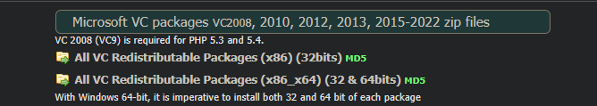

This is a comprehensive guide to setting up a full-stack login/register application. This is a complete beginner guide and all the stepts are explained in detail.
Look for the following icon if you want a detailed explaination of the current topic "[^1]"

## Technologies Used in This Project

### Backend
- **Node.js** - JavaScript runtime environment
- **Express** - Web application framework for Node.js
- **TypeScript** - Typed JavaScript language
- **MySQL** - Relational database
- **WAMP Server** - Windows, Apache, MySQL, and PHP stack
- **bcryptjs** - Password hashing library
- **jsonwebtoken (JWT)** - Authentication token implementation
- **cors ** - Cross-Origin Resource Sharing middleware
- **dotenv** - Environment variable management

### Frontend
- **React** - JavaScript library for building user interfaces
- **TypeScript** - For type safety
- **React Bootstrap** - UI component library
- **axios** - Promise-based HTTP client
- **react-router-dom** - Client-side routing

### Development Tools
- **npm** - Package manager
- **ts-node-dev** - TypeScript execution and development environment
- **phpMyAdmin** (via WAMP) - Database management tool

---

*NOTE*: this guide is for Windows. Commands will not work on Linux or Mac

---

Let's start with the project setup:


# Full-Stack React + Express Login/Register Application Setup

## Prerequisites
- Node.js (v16 or later)

  To install Node.js go to the offcial website and run the installer:
  https://nodejs.org/en
- npm (v8 or later)

 To install npm run the following command in cmd
  
  ```cmd
  npm install -g npm@latest
  ``` 
- MySQL installed and running
(This is included with WAMP, see following step)

## Detailed Step-by-Step Setup

### Set up wamp server
Go to: https://wampserver.aviatechno.net/?lang=en= 
And scroll all the way down to the page where it says: 
All VC Redistributable Packages (x86_x64) (32 & 64bits) MD5 



### 1. Create Project Directory and Initialize
```bash
# Create a new directory for your project
mkdir fullstack-login-app
cd fullstack-login-app

# Create subdirectories for frontend and backend
mkdir frontend backend
```

### 2. Backend Setup (Express + TypeScript + MySQL)
```bash
# Navigate to backend directory
cd backend

# Initialize npm project
npm init -y

# Install core dependencies
npm install express mysql2 bcryptjs jsonwebtoken cors dotenv

# Install TypeScript and type definitions
npm install -D typescript @types/express @types/node @types/bcryptjs @types/jsonwebtoken ts-node-dev

# Initialize TypeScript configuration
npx tsc --init
```

### 3. Frontend Setup (React + TypeScript + React Bootstrap)
```bash
# Navigate back to project root
cd ..

# Create React app with TypeScript template
npx create-react-app frontend --template typescript

# Navigate to frontend
cd frontend

# Install additional dependencies
npm install react-bootstrap bootstrap axios react-router-dom
```
Next you want to define a better folder structure.
You can do this manually or just run the following command with powershell:
```powershell
# For backend
cd backend
mkdir src, src\controllers, src\routes, src\models, src\middleware, src\config

# For frontend
cd ..\frontend
mkdir src\components, src\pages, src\services
```


### 4. Database Preparation
For the next part I recommend just using WAMP to have phpmadmin installed/running.

Open WAMP and go to localhost/phpmyadmin

Create the database and table manually using the GUI.

Or navigate to the SQL tab and run the following commands:

```sql
# Create database
CREATE DATABASE login_app_db;
```
Then navigate to the database you just created and run the following command:

```sql
# Create users table
CREATE TABLE users (
    id INT AUTO_INCREMENT PRIMARY KEY,
    username VARCHAR(50) UNIQUE NOT NULL,
    email VARCHAR(100) UNIQUE NOT NULL,
    password VARCHAR(255) NOT NULL,
    created_at TIMESTAMP DEFAULT CURRENT_TIMESTAMP
);
```

### Recommended Project Structure
(This example is simplified and is not 100% accurate) 

This is what the sturcture of your project should look like:
```
fullstack-login-app/
│
├── backend/
│   ├── src/
│   │   ├── controllers/
│   │   ├── routes/
│   │   ├── models/
│   │   ├── middleware/
│   │   └── server.ts
│   ├── package.json
│   └── tsconfig.json
│
└── frontend/
    ├── src/
    │   ├── components/
    │   ├── pages/
    │   ├── services/
    │   └── App.tsx
    ├── package.json
    └── tsconfig.json
```

### Why This Project Structure

#### Separation of Concerns

Dividing backend and frontend into separate directories creates a clear separation, making it easier to understand the codebase
Each part can be developed and deployed independently if needed


#### Modularity and Maintenance

controllers: Handle request processing and response generation
routes: Define API endpoints and connect them to controllers
models: Manage data structure and database interactions
middleware: Handle cross-cutting concerns like authentication
This organized structure makes the code more maintainable as it grows


#### Industry Standard

This structure follows conventions used in many professional Node.js/Express applications
Makes it easier for other developers to understand your codebase


## Step-by-Step Implementation Guide for Authentication System

## 1. Database Connection Setup

### Step 1.1: Create environment file 


####  1. Navigate to the right directory

Make sure you are in the project root directory
How you do this depends on where you are currently in the command line. 

How do I navigate in the terminal?[^2]

Then navigate to the backend directory:
```cmd
cd backend
```

 ####  2. Create a new file using CMD
```cmd
echo. > .env
```
####  Or using powershell:
```powershell
New-Item -Path .env -ItemType File -Force
```
####  3. Add JWT Secret to Environment File

In the .env file, add the following content:

```
PORT=5000 
DB_HOST=localhost
DB_USER=root
DB_PASSWORD=
DB_NAME=login_app_db
JWT_SECRET=your_super_secure_jwt_secret
```
What is a JWT secret?[^3]

4. Replace `your_password_here` with your actual MySQL password
   you can leave it empty if (you don't have a password set for the root user)
5. Replace `your_super_secure_jwt_secret` with a strong random string (at least 32 characters)

### **Step 1.2: Create database configuration file**
*NOTE:* For this part there will be a step by step guide for both CMD and PowerShell
But for the rest of the project, I will only provide the CMD commands
If you want to use PowerShell, you can look up the respective commands
#### Option 1: Using Command Prompt (CMD)

1. Navigate to the backend directory
  ```cmd
  cd backend
  ```

2. Create the config directory
  ```cmd
  mkdir src\config
  ```

3. Navigate to the config directory
  ```cmd
  cd src\config
  ```

4. Create the database.ts file
  ```cmd
  echo. > database.ts
  ```

5. Open the file in your editor and add the following code:
  ```typescript
  import mysql from 'mysql2';
  import dotenv from 'dotenv';

  // Load environment variables
  dotenv.config();

  // Create MySQL connection
  export const dbConnection = mysql.createConnection({
    host: process.env.DB_HOST || 'localhost',
    user: process.env.DB_USER || 'root',
    password: process.env.DB_PASSWORD || '',
    database: process.env.DB_NAME || 'login_app_db'
  });
  ```

#### Option 2: Using PowerShell

1. Navigate to the backend directory
  ```powershell
  cd backend
  ```

2. Create the config directory
  ```powershell
  New-Item -Path "src\config" -ItemType Directory -Force
  ```

3. Create the database.ts file directly
  ```powershell
  New-Item -Path "src\config\database.ts" -ItemType File -Force
  ```

4. Open the file in your editor and add the following code:
  ```typescript
  import mysql from 'mysql2';
  import dotenv from 'dotenv';

  // Load environment variables
  dotenv.config();

  // Create MySQL connection
  export const dbConnection = mysql.createConnection({
    host: process.env.DB_HOST || 'localhost',
    user: process.env.DB_USER || 'root',
    password: process.env.DB_PASSWORD || '',
    database: process.env.DB_NAME || 'login_app_db'
  });
  ```

## 2. User Model Creation

**Step 2.1: Create user model**

1. Navigate to the backend directory
  ```cmd
  cd backend
  ```

2. Create models directory (if it doesn't exist)
  ```cmd
  mkdir src\models
  ``` 

3. Navigate to the models directory
  ```cmd
  cd src\models
  ```

4. Create the user model file
  ```cmd
  echo. > userModel.ts
  ```

5. Open the file in your preferred text editor and add the following code:
  ```typescript
  import { dbConnection } from '../config/database';
  import bcrypt from 'bcryptjs';

  interface User {
    id?: number;
    username: string;
    email: string;
    password: string;
    created_at?: Date;
  }

  export const UserModel = {
    // Find user by email
    findByEmail: (email: string): Promise<User | null> => {
     return new Promise((resolve, reject) => {
      dbConnection.query(
        'SELECT * FROM users WHERE email = ?',
        [email],
        (err, results: any) => {
         if (err) return reject(err);
         if (results.length === 0) return resolve(null);
         return resolve(results[0]);
        }
      );
     });
    },

    // Find user by username
    findByUsername: (username: string): Promise<User | null> => {
     return new Promise((resolve, reject) => {
      dbConnection.query(
        'SELECT * FROM users WHERE username = ?',
        [username],
        (err, results: any) => {
         if (err) return reject(err);
         if (results.length === 0) return resolve(null);
         return resolve(results[0]);
        }
      );
     });
    },

    // Create new user
    create: async (userData: User): Promise<User> => {
     // Hash password
     const salt = await bcrypt.genSalt(10);
     const hashedPassword = await bcrypt.hash(userData.password, salt);

     return new Promise((resolve, reject) => {
      dbConnection.query(
        'INSERT INTO users (username, email, password) VALUES (?, ?, ?)',
        [userData.username, userData.email, hashedPassword],
        (err, result: any) => {
         if (err) return reject(err);
         
         // Return created user (without password)
         const newUser = {
          id: result.insertId,
          username: userData.username,
          email: userData.email,
          password: '',
          created_at: new Date()
         };
         
         return resolve(newUser);
        }
      );
     });
    }
  };
  ```

## 3. Authentication Middleware

**Step 3.1: Create auth middleware**
1. Navigate to the backend directory
  ```cmd
  cd backend/src
  ```
  
2. Create a directory: `middleware`
```cmd
mkdir middleware
```

3. Inside that directory, create a file named `authMiddleware.ts`
```cmd
echo. > middleware\authMiddleware.ts
``` 

4. Add the following code: 
   ```typescript
   import { Request, Response, NextFunction } from 'express';
   import jwt from 'jsonwebtoken';
   import dotenv from 'dotenv';

   dotenv.config();

   interface AuthRequest extends Request {
     user?: any;
   }

   export const authenticateToken = (
     req: AuthRequest,
     res: Response,
     next: NextFunction
   ) => {
     // Get token from header
     const authHeader = req.headers['authorization'];
     const token = authHeader && authHeader.split(' ')[1]; // Bearer TOKEN
     
     if (!token) {
       return res.status(401).json({ message: 'Access denied. No token provided.' });
     }

     try {
       // Verify token
       const secret = process.env.JWT_SECRET || 'fallback_secret';
       const decoded = jwt.verify(token, secret);
       req.user = decoded;
       next();
     } catch (error) {
       return res.status(403).json({ message: 'Invalid token' });
     }
   };
   ```

## 4. Authentication Controllers

**Step 4.1: Create auth controller**

1. Ensure you're in the backend/src directory: 
```cmd
cd backend/src
```
2. Create a directory: `controllers`
```cmd
mkdir controllers
```
3. Inside that directory, create a file named `authController.ts`
```cmd
echo. > controllers\authController.ts
```
4. Add the following code:
   ```typescript
   import { Request, Response } from 'express';
   import bcrypt from 'bcryptjs';
   import jwt from 'jsonwebtoken';
   import { UserModel } from '../models/userModel';
   import dotenv from 'dotenv';

   dotenv.config();

   export const AuthController = {
     // Register a new user
     register: async (req: Request, res: Response) => {
       try {
         const { username, email, password } = req.body;

         // Validate input
         if (!username || !email || !password) {
           return res.status(400).json({ message: 'All fields are required' });
         }

         // Check if user already exists
         const existingEmail = await UserModel.findByEmail(email);
         if (existingEmail) {
           return res.status(400).json({ message: 'Email already in use' });
         }

         const existingUsername = await UserModel.findByUsername(username);
         if (existingUsername) {
           return res.status(400).json({ message: 'Username already taken' });
         }

         // Create user
         const newUser = await UserModel.create({ username, email, password });

         // Generate JWT
         const token = jwt.sign(
           { id: newUser.id, username: newUser.username },
           process.env.JWT_SECRET || 'fallback_secret',
           { expiresIn: '1h' }
         );

         res.status(201).json({ token, user: { id: newUser.id, username, email } });
       } catch (error) {
         console.error('Registration error:', error);
         res.status(500).json({ message: 'Server error during registration' });
       }
     },

     // Login user
     login: async (req: Request, res: Response) => {
       try {
         const { email, password } = req.body;

         // Validate input
         if (!email || !password) {
           return res.status(400).json({ message: 'All fields are required' });
         }

         // Find user by email
         const user = await UserModel.findByEmail(email);
         if (!user) {
           return res.status(400).json({ message: 'Invalid credentials' });
         }

         // Compare passwords
         const isMatch = await bcrypt.compare(password, user.password);
         if (!isMatch) {
           return res.status(400).json({ message: 'Invalid credentials' });
         }

         // Generate JWT
         const token = jwt.sign(
           { id: user.id, username: user.username },
           process.env.JWT_SECRET || 'fallback_secret',
           { expiresIn: '1h' }
         );

         res.json({
           token,
           user: { id: user.id, username: user.username, email: user.email }
         });
       } catch (error) {
         console.error('Login error:', error);
         res.status(500).json({ message: 'Server error during login' });
       }
     },

     // Get current user profile
     getProfile: async (req: Request, res: Response) => {
       try {
         // Use req.user from middleware
         const user = await UserModel.findByEmail((req as any).user.email);
         
         if (!user) {
           return res.status(404).json({ message: 'User not found' });
         }
         
         // Return user without password
         const { password, ...userWithoutPassword } = user;
         res.json(userWithoutPassword);
       } catch (error) {
         console.error('Profile error:', error);
         res.status(500).json({ message: 'Server error retrieving profile' });
       }
     }
   };
   ```
#TODO
## 5. Authentication Routes

1. Ensure you're in the backend/src directory: 
```cmd
cd backend/src
```
2. Create a directory: `src/routes`
```cmd
mkdir routes
``` 
3. Inside that directory, create a file named `authRoutes.ts`
```cmd
echo. > routes\authRoutes.ts
```

3. Add the following code:
   ```typescript
   import express from 'express';
   import { AuthController } from '../controllers/authController';
   import { authenticateToken } from '../middleware/authMiddleware';

   const router = express.Router();

   // Register route
   router.post('/register', AuthController.register);

   // Login route
   router.post('/login', AuthController.login);

   // Get user profile - protected route
   router.get('/profile', authenticateToken, AuthController.getProfile);

   export default router;
   ```

## 6. Express Server Configuration

**Step 6.1: Create main server file**
1. In the `src` directory, create a file named `server.ts`
```cmd
echo. > server.ts
```

2. Add the following code:
   ```typescript
   import express from 'express';
   import cors from 'cors';
   import dotenv from 'dotenv';
   import authRoutes from './routes/authRoutes';
   import { dbConnection } from './config/database';

   // Load environment variables
   dotenv.config();

   const app = express();
   const PORT = process.env.PORT || 5000;

   // Middleware
   app.use(cors());
   app.use(express.json());

   // Database Connection
   dbConnection.connect((err) => {
     if (err) {
       console.error('Error connecting to the database:', err);
       process.exit(1);
     }
     console.log('Successfully connected to MySQL database');
   });

   // Routes
   app.use('/api/auth', authRoutes);

   // Start server
   app.listen(PORT, () => {
     console.log(`Server running on port ${PORT}`);
   });

   export default app;
   ```

**Step 6.2: Configure package.json for running the server**
1. Open the `package.json` file in your backend directory
2. Add the following scripts:
   ```json
   "scripts": {
     "build": "tsc",
     "start": "node dist/server.js",
     "dev": "ts-node-dev src/server.ts"
   }
   ```

## 7. Frontend Authentication Service

**Step 7.1: Create auth service**
1. Navigate to your frontend directory
```cmd
cd frontend
```
2. Create a directory: `src/services`
```cmd
mkdir src\services
```

3. Inside that directory, create a file named `authService.ts`
```cmd
echo. > src\services\authService.ts
```

4. Add the following code:
   ```typescript
   import axios from 'axios';
   //run this command in the terminal to install axios: npm install axios

   const API_URL = 'http://localhost:5000/api/auth';

   // Register user
   export const register = async (username: string, email: string, password: string) => {
     try {
       const response = await axios.post(`${API_URL}/register`, {
         username,
         email,
         password
       });
       
       if (response.data.token) {
         localStorage.setItem('user', JSON.stringify(response.data));
       }
       
       return response.data;
     } catch (error) {
       if (axios.isAxiosError(error) && error.response) {
         throw new Error(error.response.data.message);
       }
       throw new Error('Registration failed');
     }
   };

   // Login user
   export const login = async (email: string, password: string) => {
     try {
       const response = await axios.post(`${API_URL}/login`, {
         email,
         password
       });
       
       if (response.data.token) {
         localStorage.setItem('user', JSON.stringify(response.data));
       }
       
       return response.data;
     } catch (error) {
       if (axios.isAxiosError(error) && error.response) {
         throw new Error(error.response.data.message);
       }
       throw new Error('Login failed');
     }
   };

   // Logout user
   export const logout = () => {
     localStorage.removeItem('user');
   };

   // Get current user
   export const getCurrentUser = () => {
     const userJson = localStorage.getItem('user');
     if (!userJson) return null;
     return JSON.parse(userJson);
   };

   // Set auth header
   export const authHeader = () => {
     const user = getCurrentUser();
     if (user && user.token) {
       return { Authorization: `Bearer ${user.token}` };
     }
     return {};
   };
   ```

## 8. Frontend Login Component

**Step 8.1: Create login component**
1. Create a directory: `src/components/auth`
2. Inside that directory, create a file named `Login.tsx`
3. Add the following code:
   ```typescript
   import React, { useState } from 'react';
   import { Form, Button, Alert, Container, Row, Col, Card } from 'react-bootstrap';
   import { login } from '../../services/authService';
   import { useNavigate } from 'react-router-dom';

   const Login: React.FC = () => {
     const [email, setEmail] = useState('');
     const [password, setPassword] = useState('');
     const [loading, setLoading] = useState(false);
     const [error, setError] = useState('');
     const navigate = useNavigate();

     const handleLogin = async (e: React.FormEvent) => {
       e.preventDefault();
       setError('');
       
       if (!email || !password) {
         setError('All fields are required');
         return;
       }
       
       try {
         setLoading(true);
         await login(email, password);
         navigate('/dashboard');
       } catch (err) {
         setError(err instanceof Error ? err.message : 'Login failed');
       } finally {
         setLoading(false);
       }
     };

     return (
       <Container>
         <Row className="justify-content-md-center mt-5">
           <Col md={6}>
             <Card>
               <Card.Header as="h5">Login</Card.Header>
               <Card.Body>
                 {error && <Alert variant="danger">{error}</Alert>}
                 <Form onSubmit={handleLogin}>
                   <Form.Group className="mb-3">
                     <Form.Label>Email address</Form.Label>
                     <Form.Control 
                       type="email" 
                       value={email}
                       onChange={(e) => setEmail(e.target.value)}
                       placeholder="Enter email" 
                       required
                     />
                   </Form.Group>

                   <Form.Group className="mb-3">
                     <Form.Label>Password</Form.Label>
                     <Form.Control 
                       type="password" 
                       value={password}
                       onChange={(e) => setPassword(e.target.value)}
                       placeholder="Password" 
                       required
                     />
                   </Form.Group>
                   
                   <Button 
                     variant="primary" 
                     type="submit" 
                     disabled={loading}
                     className="w-100"
                   >
                     {loading ? 'Logging in...' : 'Login'}
                   </Button>
                 </Form>
               </Card.Body>
               <Card.Footer className="text-center">
                 Don't have an account? <a href="/register">Register</a>
               </Card.Footer>
             </Card>
           </Col>
         </Row>
       </Container>
     );
   };

   export default Login;
   ```

## 9. Frontend Register Component

**Step 9.1: Create register component**
1. Inside the `src/components/auth` directory, create a file named `Register.tsx`
2. Add the following code:
   ```typescript
   import React, { useState } from 'react';
   import { Form, Button, Alert, Container, Row, Col, Card } from 'react-bootstrap';
   import { register } from '../../services/authService';
   import { useNavigate } from 'react-router-dom';

   const Register: React.FC = () => {
     const [username, setUsername] = useState('');
     const [email, setEmail] = useState('');
     const [password, setPassword] = useState('');
     const [confirmPassword, setConfirmPassword] = useState('');
     const [loading, setLoading] = useState(false);
     const [error, setError] = useState('');
     const navigate = useNavigate();

     const handleRegister = async (e: React.FormEvent) => {
       e.preventDefault();
       setError('');
       
       if (!username || !email || !password || !confirmPassword) {
         setError('All fields are required');
         return;
       }
       
       if (password !== confirmPassword) {
         setError('Passwords do not match');
         return;
       }
       
       try {
         setLoading(true);
         await register(username, email, password);
         navigate('/dashboard');
       } catch (err) {
         setError(err instanceof Error ? err.message : 'Registration failed');
       } finally {
         setLoading(false);
       }
     };

     return (
       <Container>
         <Row className="justify-content-md-center mt-5">
           <Col md={6}>
             <Card>
               <Card.Header as="h5">Register</Card.Header>
               <Card.Body>
                 {error && <Alert variant="danger">{error}</Alert>}
                 <Form onSubmit={handleRegister}>
                   <Form.Group className="mb-3">
                     <Form.Label>Username</Form.Label>
                     <Form.Control 
                       type="text" 
                       value={username}
                       onChange={(e) => setUsername(e.target.value)}
                       placeholder="Enter username" 
                       required
                     />
                   </Form.Group>

                   <Form.Group className="mb-3">
                     <Form.Label>Email address</Form.Label>
                     <Form.Control 
                       type="email" 
                       value={email}
                       onChange={(e) => setEmail(e.target.value)}
                       placeholder="Enter email" 
                       required
                     />
                   </Form.Group>

                   <Form.Group className="mb-3">
                     <Form.Label>Password</Form.Label>
                     <Form.Control 
                       type="password" 
                       value={password}
                       onChange={(e) => setPassword(e.target.value)}
                       placeholder="Password" 
                       required
                     />
                   </Form.Group>
                   
                   <Form.Group className="mb-3">
                     <Form.Label>Confirm Password</Form.Label>
                     <Form.Control 
                       type="password" 
                       value={confirmPassword}
                       onChange={(e) => setConfirmPassword(e.target.value)}
                       placeholder="Confirm password" 
                       required
                     />
                   </Form.Group>
                   
                   <Button 
                     variant="primary" 
                     type="submit" 
                     disabled={loading}
                     className="w-100"
                   >
                     {loading ? 'Registering...' : 'Register'}
                   </Button>
                 </Form>
               </Card.Body>
               <Card.Footer className="text-center">
                 Already have an account? <a href="/login">Login</a>
               </Card.Footer>
             </Card>
           </Col>
         </Row>
       </Container>
     );
   };

   export default Register;
   ```

## 10. Frontend Dashboard Component

**Step 10.1: Create dashboard component**
1. Create a directory: `src/components/dashboard`
2. Inside that directory, create a file named `Dashboard.tsx`
3. Add the following code:
   ```typescript
   import React, { useEffect, useState } from 'react';
   import { Container, Row, Col, Card, Button } from 'react-bootstrap';
   import { getCurrentUser, logout } from '../../services/authService';
   import { useNavigate } from 'react-router-dom';

   const Dashboard: React.FC = () => {
     const [user, setUser] = useState<any>(null);
     const navigate = useNavigate();

     useEffect(() => {
       const currentUser = getCurrentUser();
       if (!currentUser) {
         navigate('/login');
         return;
       }
       setUser(currentUser.user);
     }, [navigate]);

     const handleLogout = () => {
       logout();
       navigate('/login');
     };

     if (!user) {
       return <div>Loading...</div>;
     }

     return (
       <Container>
         <Row className="justify-content-md-center mt-5">
           <Col md={8}>
             <Card>
               <Card.Header as="h5">Dashboard</Card.Header>
               <Card.Body>
                 <Card.Title>Welcome, {user.username}!</Card.Title>
                 <Card.Text>
                   You have successfully logged in to the application.
                 </Card.Text>
                 <div className="mt-4">
                   <h6>User Information:</h6>
                   <ul className="list-group">
                     <li className="list-group-item">Username: {user.username}</li>
                     <li className="list-group-item">Email: {user.email}</li>
                     <li className="list-group-item">User ID: {user.id}</li>
                   </ul>
                 </div>
                 <Button 
                   variant="primary" 
                   onClick={handleLogout}
                   className="mt-4"
                 >
                   Logout
                 </Button>
               </Card.Body>
             </Card>
           </Col>
         </Row>
       </Container>
     );
   };

   export default Dashboard;
   ```

## 11. App Routes Configuration

**Step 11.1: Update App.tsx**
1. Open the `src/App.tsx` file in your frontend directory
2. Replace the content with:
   ```typescript
   import React from 'react';
   import { BrowserRouter as Router, Routes, Route, Navigate } from 'react-router-dom';
   import { Container } from 'react-bootstrap';
   import Login from './components/auth/Login';
   import Register from './components/auth/Register';
   import Dashboard from './components/dashboard/Dashboard';
   import { getCurrentUser } from './services/authService';
   import 'bootstrap/dist/css/bootstrap.min.css';

   // Protected route component
   const ProtectedRoute = ({ children }: { children: React.ReactNode }) => {
     const user = getCurrentUser();
     if (!user) {
       return <Navigate to="/login" />;
     }
     return <>{children}</>;
   };

   function App() {
     return (
       <Router>
         <Container className="py-4">
           <Routes>
             <Route path="/login" element={<Login />} />
             <Route path="/register" element={<Register />} />
             <Route 
               path="/dashboard" 
               element={
                 <ProtectedRoute>
                   <Dashboard />
                 </ProtectedRoute>
               } 
             />
             <Route path="/" element={<Navigate to="/login" />} />
           </Routes>
         </Container>
       </Router>
     );
   }

   export default App;
   ```

**Step 11.2: Update index.css (optional)**
1. Open the `src/index.css` file
2. Add some basic styling:
   ```css
   body {
     margin: 0;
     font-family: -apple-system, BlinkMacSystemFont, 'Segoe UI', 'Roboto', 'Oxygen',
       'Ubuntu', 'Cantarell', 'Fira Sans', 'Droid Sans', 'Helvetica Neue',
       sans-serif;
     -webkit-font-smoothing: antialiased;
     -moz-osx-font-smoothing: grayscale;
     background-color: #f8f9fa;
   }

   code {
     font-family: source-code-pro, Menlo, Monaco, Consolas, 'Courier New',
       monospace;
   }

   .card {
     box-shadow: 0 4px 8px rgba(0, 0, 0, 0.1);
   }
   ```

## 12. Running the Application

**Step 12.1: Start the backend server**
1. Navigate to the backend directory
2. Run:
   ```bash
   npm run dev
   ```

**Step 12.2: Start the frontend application**
1. Navigate to the frontend directory
2. Run:
   ```bash
   npm start
   ```

## 13. Testing the Application

1. Open your browser and navigate to `http://localhost:3000`
2. You should be redirected to the login page
3. Click "Register" to create a new account
4. After registering, you'll be redirected to the dashboard
5. Try logging out and logging back in
6. Try accessing the dashboard directly without logging in - you should be redirected to login

[^1]:
Example text

[^2]: https://www.digitalcitizen.life/command-prompt-how-use-basic-commands/


[^3]: The JWT_SECRET is only needed in your server-side code via this .env file You do NOT need to configure it in phpMyAdmin or your database
This secret is used exclusively by your backend code to sign and verify authentication tokens
Make sure to use a strong, random string for better security
Never expose this secret in client-side code or commit it to public repositories

[^4]:
